# 🌃 판교의 밤 (PDNight)
개발자들을 위한 오프라인 번개모임 플랫폼

## 📑 목차
- [프로젝트 소개](#-프로젝트-소개)
- [핵심 기능](#-핵심-기능)
- [아키텍쳐](#arch)
- [설계 문서](#-설계-문서)
  - [ERD](#-erd)
  - [와이어 프레임](#wireframe)
  - [API 명세서](#-api-명세서)
- [기술적 의사 결정](#-기술적-의사-결정)
- [트러블 슈팅](#troubleshooting)
- [성능 개선](#-성능-개선)
- [기술 스택](#tech-stack)
- [팀 구성원 소개](#-팀-구성원-소개)

---
## 🌃 프로젝트 소개

<p align="center">
  
</p>

> ### “판교 직장인들을 위한 **실시간 번개 모임 플랫폼**, 오늘 퇴근 후 바로 만나세요.”

**판교의 밤**은 판교를 중심으로 한 실시간 번개 모임 플랫폼입니다.

개발이라는 공통 관심사를 매개로 가볍고 빠른 만남을 주선하고,  
사용자 리뷰 · 모임 기록 · 채팅을 통해 **지속적인 연결과 신뢰**를 만들어갑니다.

이 플랫폼은 근무지역/거주지역, 직군, 취미/기술스택 기반의 모임을 추천하고 연결합니다.


---

### 🙅 이런 점, 공감하시죠?

<p align="center">
  
</p>

- 모임 정보가 여기저기 흩어져 찾아다니기 힘들다
- 누가 올지 몰라서 불안하다, 후기도 없다
- 모임 끝나면 관계도 끝, 이어지지 않는다

---

### 🙆 그래서 **판교의 밤**은 이렇게 해결합니다!

- **관심사 기반 추천**: 직군, 취미, 기술 스택 태그로 나와 맞는 모임 매칭
- **신뢰도 관리**: 리뷰, 프로필, 참여 이력으로 안심할 수 있는 만남
- **지속적 연결**: 채팅과 팔로우로 모임이 끝나도 관계가 이어진다
---
## 💻 핵심 기능
### 👨‍👩‍👧 사용자 이용 흐름


<details>
<summary> 전체 서비스 흐름도 </summary>


> 💡프로모션: 사용자가 직접 신청·참여할 수 있는 이벤트 활동입니다. (예: 선착순 모집 이벤트)

> 💡쿠폰: 관리자가 사용자에게 제공하는 혜택입니다. (예: 특정 지점 할인 쿠폰)

</details>

### ✍️ **작성자: 모임 게시글 작성**
- 필수 항목: **제목, 모임 일시(언제 열릴지), 내용, 최대 참가자 수**
- 선택 제한: **성별 제한, 직업군(직무) 제한, 나이 제한**
- 탐색을 위한 **태그들** 설정 (예: `#스프링 #백엔드 #스터디 #판교`)
- 공개/선착순 여부 선택
  - **선착순 모임**: 승인 없이 정원 선착순 자동 참여
    - **승인제 모임**: 호스트(작성자)가 신청을 **수락**해야 참여 확정

### 🔎 **사용자: 검색 & 필터로 빠르게 찾기**
- **제목 / 내용** 기준 **부분 일치** 검색 지원
- **태그 기반** 탐색 (관심사 중심)
- 정렬: **최신순 / 인기순(좋아요) / 추천**

 <details>
 <summary><b>필터 항목 보기</b></summary>

- 지역: **판교/성남 중심**
- 모임 일시: 날짜/시간 범위
- **성별 제한**
- **직업군(직무) 제한**
- **연령대**(예: 20대/30대 등)
- 태그 (복수 선택)
- 정원(최대 참가자 수) 범위
- 상태: **모집중 / 성사 / 닫힘**
 </details>

> **예시**
- `제목: "퇴근 후"` + 태그 `#스프링` → 오늘 저녁 스프링 번개
- `내용: "스터디"` + 직무 `백엔드` + 연령대 `20–30대`

### 🙋 **참여 방식**
- **선착순 모임**: 신청 즉시 **자동 승인 → 참여 확정**
- **승인제 모임**: 신청 → 호스트가 **수락/거절** 결정
- 참여 확정 시 **모임 채팅방** 자동 생성 → **실시간 커뮤니케이션**

### 👥 **팔로우 & 소셜**
- 마음에 드는 사용자를 **팔로우**
- 팔로우한 사용자의 새 게시글을 **우선 노출** (추천/알림 활용)
- 모임 종료 후 **서로 리뷰**로 신뢰도 축적 → 다음 번개 매칭 품질 ↑

### 🔔 **알림 (요약)**
- **신청/수락/거절/성사** 상태 변경
- **초대/수락/거절**
- **팔로우한 사용자 새 게시글**
- **댓글/후기/쿠폰** 등 액티비티

---
<h2 id="arch"> 🏛️ 아키텍쳐 </h2>


### 

---

## 📘 설계 문서

### 🔗 ERD

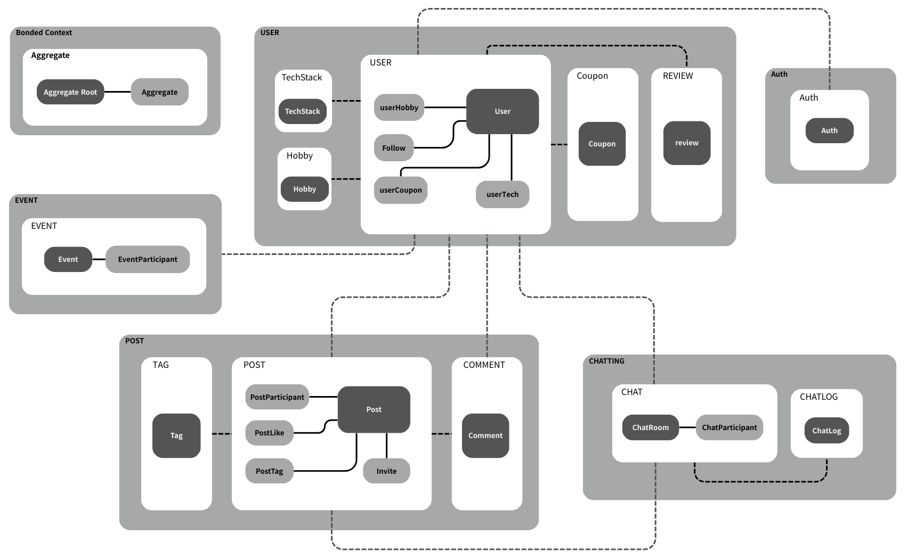

[버전 별 ERD By notion](https://teamsparta.notion.site/ERD-2562dc3ef514807f812ddaf68361e7e8)

[버전 별 책임 구조 By notion](https://www.notion.so/teamsparta/2562dc3ef5148037a3e3e424c3537051)

---

<h2 id="wireframe"> 🖼️ 와이어 프레임 </h2>

<details>

<summary> 와이어 프레임 </summary>


1. 회원가입/로그인


---
2. 게시글


---
3. 메뉴


</details>

---
### 🌐 API 명세서

[API 명세서 By springdoc](https://pdnight.duckdns.org/swagger-ui)

[API 명세서 By notion](https://teamsparta.notion.site/API-2562dc3ef5148049a9c9c9dd50312c65)


---

## 🙋 기술적 의사 결정

<details>
<summary> <strong> 🏗️ 도메인 주도 설계 (DDD: Domain-Driven Design) 도입 배경 및 선택 이유 </strong> </summary>

### 도입 배경과 필요성

**[문제 상황]**
<br />❌ 프로젝트 진행 중 기능 다양화 (참여·리뷰·추천 등) → 도메인 간 의존도 증가
<br />❌ 기존 단순 레이어 구조 → 한 기능 수정 시 다른 기능에 예기치 않은 영향 발생
<br />❌ 경계(Responsibility Boundary) 불명확 → 로직 위치 결정 혼선, 회의 증가, 피로도 상승
<br />❌ 결과적으로 유지보수 부담 및 확장성 저하 우려

**[해결 방안: DDD (Domain-Driven Design)]**
<br />✅ 단순 기술 추가가 아닌 설계 철학 전환
<br />✅ 도메인 중심 경계 설정으로 의존성 관리
<br />✅ 도메인 로직과 외부 기술 분리 → 안정적인 구조 확보
<br />✅ 유지보수성·확장성 모두 강화

---
### DDD 핵심 개념
**[설계 철학]**
<br />🔹 데이터 중심이 아닌 **비즈니스 로직 중심**
<br />🔹 **Bounded Context** 로 도메인별 독립성 확보
<br />🔹 도메인 간 결합도 최소화 → 기능 변경·확장 용이

**[핵심 요소]**
<br />🔹 **Bounded Context** : 도메인별 책임과 데이터 범위 명확화
<br />🔹 **Aggregate & Aggregate Root** : 데이터 일관성 유지
<br />🔹 **Layered Architecture** : 표현 → 응용 → 도메인 → 인프라 계층

---
### Kafka를 통한 경계 설정

| 구분               | 내용                                                                                              |
| ---------------- |-------------------------------------------------------------------------------------------------|
| **도입 이유**        | - 도메인 간 직접 호출 제거<br>- 이벤트 발행·구독 기반 비동기 통신<br>- 장애 전파 최소화                                        |
| **적용 예시 (회원가입)** | - **인증 도메인**: 인증 완료 후 사용자 저장에 필요한 데이터 이벤트 발행<br> - **사용자 도메인**: 이벤트 구독 후 동일 식별자를 가진 사용자 데이터 저장 |
| **효과**           | - 한 도메인 변경이 다른 도메인에 직접 영향 없음<br>- **확장성 향상 / 결합도 감소**                                           |

---
### 계층 구조와 설계 방식


**🎯 핵심 원칙: DIP (Dependency Inversion Principle)**
<br />🔹 각 계층은 명확한 참조 방향을 가짐
<br />🔹 도메인 계층은 추상화된 인터페이스만 보유 → 인프라/외부 기술 변경에도 영향 최소화

**⚙️ Kafka 컨슈머 설계**
<br />🔹 Kafka Consumer는 인프라 계층에서 구현
<br />🔹 응용 계층을 통해 도메인 로직 호출
<br />🔹 도메인 계층은 외부 기술에 의존하지 않음

**✅ 기대 효과**
<br />🔹 외부 기술 교체에도 도메인 로직 수정 불필요
<br />🔹 안정적이고 확장 가능한 구조 확보

---
### DDD 도입 후 변화

```
[결합도 감소]
- 도메인 간 의존성이 현저히 줄어듦
- 기능 변경 시 영향을 받는 범위 최소화
- 로직이 기능별로 명확하게 분리 → 유지보수 용이
```
```
[데이터 일관성 강화]
- 애그리거트 루트를 통해서만 하위 애그리거트 변경
- 데이터 무결성과 일관성 보장
```
```
[확장성 & 협업 효율 향상]
- 새로운 기능 추가 시 해당 도메인에만 집중
- 협업 속도 증가 + 품질 개선
```
</details>


<details>

<summary> <strong> 📨 Kafka 도입 배경 및 선택 이유 </strong> </summary>

### 도입 배경과 필요성

**[문제 상황]**
<br />❌ 이벤트 기반으로 서비스간 의존도가 높음 ➡ 서비스간의 의존도가 높으면 확장성이나 관리에 어려움이 존재
<br />❌ 에러 발생시 이벤트 데이터 손실 발생 ➡ 이벤트 데이터가 손실되면 데이터 정합성에 문제
<br />❌ 테스트 및 확장성 측면에 한계 ➡ 서버 운영 관리에 어려움이 존재

**[Kafka를 도입]**
<br />✅ 서비스 간의 의존도 감소, 확장성 향상
<br />✅ 이벤트 데이터의 손실 없이 처리 가능
<br />✅ 데이터의 흐름 파악 가능


---
### 재시도 처리 설계


---
### 에러 핸들러 설계 의도

**🚧 실패 메시지 격리 (DLT 라우팅)**
<br />🔹 재시도 한도 초과 시 `.DLT` 토픽으로 이동
<br />🔹 정상 트래픽 보호 & 별도 리스너 처리

**🔄 지수 백오프 재시도**
<br />🔹 초기 빠른 재시도 → 점진적 간격 증가
<br />🔹 병목 완화 + 로그 소음 감소

**⛔ Non-Retryable 예외**
<br />🔹 역직렬화 실패·검증 실패 등은 즉시 DLT
<br />🔹 지연 최소화 & 자원 절약

**👀 관측 가능성 확보**
<br />🔹 DLT 전송 시 `log.error` 기록
<br />🔹 문제 원인 추적 가능

---
### KRaft를 통한 클러스터 환경 구축

| 구분                  | 핵심 내용                                                                                             | 기대 효과                                       |
| ------------------- | ------------------------------------------------------------------------------------------------- |---------------------------------------------|
| ⚡ **아키텍처 단순화**      | - ZooKeeper 제거, Kafka 단독 클러스터 구성<br>- 메타데이터 관리 Kafka 내부 Raft 합의 기반 통합<br>- 설치·구성 서비스 수 감소         | 👉 배포 환경(Docker, K8s)에서 **네트워크·리소스 구조 단순화** |
| ⚙️ **운영 효율성**       | - ZK 전용 설정 불필요<br>- Kafka 설정만 관리<br>- `--bootstrap-server` 기반 관리 명령어 통일                           | 👉 **CLI 사용 일관성 확보**, 관리 단순화                 |
| 🛡️ **안정성 & 장애 복구** | - 컨트롤러 리더 교체 시 즉시 활성화<br>- 쿼럼 구조 기반 → 과반수 생존 시 가용성 유지<br>- 이벤트 소싱 + 스냅샷으로 빠른 복구                   | 👉 **서비스 불가 구간 최소화**, 단일 장애점 제거              |
| 📈 **확장성 & 유연성**    | - 브로커/컨트롤러 역할 겸임 or 분리 가능<br>- 노드 증설·축소 시 ZK quorum 고려 불필요                                        | 👉 브로커만 추가해도 확장, **수백만 파티션까지 대응**            |
| 💰 **성능·비용 최적화**    | - ZK 서버 리소스 절감<br>- 메타데이터 업데이트 레이어 축소 → latency 감소<br>- Kafka 단일 보안 모델 적용<br>- Kafka/ZK 버전 관리 불필요 | 👉 **CPU·메모리 절감**, 업그레이드·보안 관리 간소화           |


</details>

<details>
<summary> <strong> 🔍 Elasticsearch 도입 배경 및 선택 이유 </strong> </summary>

### 도입 배경과 필요성
**[문제 상황]**
<br />❌ 게시글의 데이터 규모가 증가할수록 성능 저하 ➡ 대용량 데이터 처리 시 DB 부담이 커져 성능 저하 발생
<br />❌ 게시글 조건 검색과 페이징 처리의 빈도수가 높음 ➡ 빈번한 요청이 DB 부하를 가중시켜 조회 성능 저하


| 구분               | Mysql                                                                                             | Elasticsearch        |
|------------------|---------------------------------------------------------------------------------------------------|----------------------|
| ⚡ **검색 성능**      | Full Table Scan 발생 가능                                                                             | 인덱스 기반 구조로 빠른 조회 가능  |
| ⚙️ **확장성**       | 수직적 확장                                                                                            | 분산 아키텍처 기반의 수평 확장 지원 |
| 🛡️ **데이터 정합성**  | 데이터 무결성 보장                   | 정합성보다는 성능 중시         |


**[게시글 조회 기능에 Elasticsearch를 도입]**
<br />✅ 대용량 데이터에 대한 검색 성능 향상
<br />✅ 조건 검색에 대한 성능 향상

---

### ElasticsearchOperations 을 선택한 이유
**1. Repository**
<br />🔹 CRUD 위주, 단순 조회가 대부분일 때 유리
<br />🔹 메소드 네이밍 기반 쿼리(findByTitleAndAuthor) 같은 단순 쿼리에 적합
<br />🔹 코드가 짧고 생산성이 높음

>단점: 복잡한 조건 검색, 커스텀 DSL에는 제약이 많음

**2. ElasticsearchOperations**
<br />🔹 검색 조건이 많고 복잡한 쿼리를 직접 DSL로 작성해야 할 때 유리
<br />🔹 `CriteriaQuery`, `NativeSearchQuery` 등을 이용해서 세밀하게 제어 가능
<br />🔹 Aggregation, 페이징, 스코어링 같은 고급 기능 활용 가능
>단점: 코드가 길어지고 생산성이 떨어짐 (Repository보다 번거로움)

**✅ ElasticsearchOperations**
<br />🔹검색 중심의 복잡한 쿼리구현을 위해 ElasticsearchOperations 을 선택

---

### 다중 조건문 구현 방법

🔹`NestedQuery`, `TermQuery` ➡️ `BoolQuery` ➡️ `NativeQuery` 순서로 조합


</details>

---

<h2 id="troubleshooting"> ⚠️ 트러블 슈팅 </h2>

<details>

<summary> <strong>🧪 통합 테스트 코드가 트랜잭션 때문에 계속 실패합니다! </strong></summary>

### 문제 상황

❌ `@TransactionalEventListener(phase = BEFORE_COMMIT)`를 사용하는 이벤트 리스너가 테스트에서 동작하지 않음

❌ `ApplicationEventPublisher.publishEvent()`를 호출했지만 이후 `UserReader`를 통해 유저를 조회했을 때 저장된 결과가 없음

❌ `@TransactionalEventListener(phase = BEFORE_COMMIT)` 는 트랜잭션 커밋 직전에 실행됨.

❌ 이벤트가 트랜잭션 범위 내에서 퍼블리시되어야 작동함.

#### 실패한 테스트 예시

```
@Test
@Transactional
@Commit
void 회원가입_이벤트_퍼블리시() {
    eventPublisher.publishEvent(...);
}
```

---

### 문제 원인

💡 `eventPublisher.publishEvent()`가 트랜잭션 범위 내에서 실행된 것처럼 보이지만 내부적으로 **즉시 동기 실행되며 트랜잭션과 연동되지 않음**

💡 `@TransactionalEventListener(phase = BEFORE_COMMIT)`는 스프링이 관리하는 트랜잭션 커밋 시점에 반응하므로 **이벤트가 이보다 먼저 퍼블리시되면 리스너가 실행되지 않음**

💡 테스트 메서드 자체에 `@Transactional`과 `@Commit`이 붙어 있어도 **이벤트 퍼블리시 시점이 커밋 직전이 아님** → 리스너 작동 안 함


---

### 해결 방법

🔹 트랜잭션 범위 내에서 퍼블리시하는 **별도 서비스 메서드** 호출

```
@Transactional
public void publishSignUpEvent(SignupRequest request) {
    publisher.publishEvent(...);

```

🔹 테스트에서는 해당 메서드를 호출

```
@Test
void 회원가입_이벤트_후_조회() {
    testEventPublisher.publishSignUpEvent(request);
    ...
}
```

- 이벤트가 이미 트랜잭션 범위 안에서 퍼블리시
- 커밋 시점에 `BEFORE_COMMIT` 리스너가 정상적으로 실행됨
- DB에 유저 데이터가 실제로 커밋됨 → 이후 조회 성공

---

### 대안

📌 `@TransactionalEventListener(fallbackExecution = true)` 사용

   - 트랜잭션이 없어도 리스너 실행되도록 설정
   - 테스트 용도로는 유용할 수 있으나, 실서비스와 동일한 조건이 아님
   - 실제 환경과 동작 방식이 달라져 테스트 신뢰도 저하 가능

📌 `@Transactional(propagation = Propagation.REQUIRES_NEW)` 적용

   - 이벤트 처리 로직을 별도 트랜잭션으로 강제 실행 가능
   - 하지만 `BEFORE_COMMIT` 의미가 퇴색 될 수 있어 주의 필요

---

### 결론
✅ `@TransactionalEventListener(phase = BEFORE_COMMIT)`는 반드시 트랜잭션 내부에서 퍼블리시된 이벤트에만 반응한다.

✅ 테스트에서 이를 확인하고 싶다면 이벤트 퍼블리시를 별도의 서비스 계층에서 수행해야 한다.

✅ `BEFORE_COMMIT` 일때는 단순히 테스트 메서드에서 `@Transactional`과 `publishEvent()`를 호출하는 것만으로는 충분하지 않다.

</details>


<details>

<summary> <strong>⚖️ CQRS를 적용했는데 책임 분리가 제대로 지켜지지 않았습니다!</strong> </summary>

### 문제 상황

❌ 우리 프로젝트는 CQRS 패턴을 사용하여 **Commander와 Reader를 구분하여 사용하기**로 결정함.
- 현재는 하나의 DB를 사용 중이지만 구조적으로 Commander와 Reader를 분리하여 서비스별 기능을 명확히 분리
- 추후 DB 분리에 대비하고자 하는 목적

❌ 하지만 실제 구현시 **Commander 서비스가 Reader를 통해 데이터를 조회**하여 수정·생성·삭제 작업을 수행하는 상황이 발생함.

---

### 문제 원인

💡 현재는 단일 DB를 사용하고 있지만 CQRS 원칙에 따라 책임을 명확히 분리한 이상 **Reader는 조회 전용, Commander는 쓰기 전용으로 사용되어야 함.**
- 추후 실제로 DB가 분리될 경우, Reader는 지연된 데이터나 복제본을 참조할 수 있음
- 이 상태에서 변경 작업을 수행하면 **데이터 정합성에 심각한 문제**가 발생할 수 있음

---

### 해결 방법 및 결론
✅ 이러한 문제점에 대해 팀원들에게 설명하고 쓰기 작업이 필요한 경우에는 **반드시 Commander 내에서 조회하도록 코드 구조를 변경.**

✅ 이로써 책임의 경계를 명확히 하고 향후 DB 분리 시 발생할 수 있는 정합성 문제를 사전에 방지할 수 있게 됨.

</details>

<details>


<summary> <strong>⛓️ JPA에서 여러 컬렉션을 패치 조인하니 'MultipleBagFetchException' 예외가 발생합니다!</strong> </summary>

### 문제 상황

❌ JPA에서 `User` 엔티티를 조회할 때 `userHobbies`와 `userTeckStacks` 두 개의 연관 컬렉션을 패치 조인(fetch join) 하여 한 번에 가져오도록 설정함

```java
List<User> users = queryFactory
        .selectFrom(user)
        .leftJoin(user.userHobbies).fetchJoin()
        .leftJoin(user.userTeckStacks).fetchJoin()
        .offset(pageable.getOffset())
        .limit(pageable.getPageSize())
        .fetch();
```

❌ 그 결과 MultipleBagFetchException가 발생함

```bash
org.hibernate.loader.MultipleBagFetchException:
cannot simultaneously fetch multiple bags: [User.userHobbies, User.userTechs]
```

---

### 문제 원인

💡 JPA(Hibernate)는 두 개 이상의 `List` 타입 컬렉션을 동시에 fetch join 할 경우 내부적으로 **카테시안 곱(Cartesian Product)** 이 발생

- `List` 타입은 Hibernate 내부적으로 `Bag` 타입으로 처리되는데 Bag은 중복을 허용하므로 Hibernate가 이를 정리할 수 없어 예외를 발생시킴

- 예를 들어 유저 1명이 취미 3개, 기술 2개를 가진다면 결과는 3 × 2 = 6개의 레코드로 늘어나게 되며 이 중복을 관리하지 못함


---

### 해결 방법

🔹 `List` → `Set` 으로 변경하기
- `Set`은 중복을 허용하지 않기 때문에 Hibernate가 결과 데이터를 적절히 처리가능
- 엔티티에서 다음과 같이 타입을 변경

```java
// --- Before ---
@OneToMany(mappedBy = "user")
private List<UserHobby> userHobbies;

@OneToMany(mappedBy = "user")
private List<UserTech> userTechs;

// --- After ---
@OneToMany(mappedBy = "user")
private Set<UserHobby> userHobbies;

@OneToMany(mappedBy = "user")
private Set<UserTech> userTechs;
```

---

### 결과
✅ 더 이상 예외가 발생하지 않고 원하는 데이터가 패치 조인을 통해 **정상적으로 조회됨**

</details>

<details>

<summary> <strong>📑 페이징 쿼리에 Fetch Join을 쓰니 메모리 페이징이 일어납니다! </strong></summary>

### 문제 상황

❌ `userHobbies`와 `userTeckStacks` 을 조회하는 과정에서 N+1 문제를 해결하기 위해 각각 `fetch join`과 **페이징 처리**를 적용함<br/>
❌ 실행은 되지만 다음과 같은 경고 메시지가 출력됨

```
firstResult/maxResults specified with collection fetch; **applying in memory**
```

> 컬렉션을 패치 조인하면서 페이징(offset, limit)을 설정했기 때문에 **메모리 내에서 페이징**이 수행된다는 의미

---

### 문제 원인

💡 Hibernate는 컬렉션(`@OneToMany`, `@ManyToMany`)에 대해 `fetch join`이 적용된 경우, DB 레벨에서 `limit`, `offset`을 이용한 페이징이 **불가능**
- 카테시안 곱 + 중복 제거 과정이 복잡하여 DB에서 정확한 row 제한이 어려움

💡 결국 Hibernate는 모든 결과를 메모리에 로딩한 후, 그 안에서 페이징을 적용함
- 이로 인해 **성능 저하 및 메모리 낭비** 발생 가능

---

### 해결 방법

🔹 QueryProjection으로 fetch join할 필드(`userHobbies`,`userTeckStacks`) 제외 후, `User` 엔티티만 페이징으로 먼저 조회<br/>
🔹 조회한 User의 ID 리스트를 추출하여, 해당 ID에 속한 취미와 기술 스택을 조회<br/>
🔹 취미와 기술 스택 조회 결과를 `UserResponse` DTO에 매핑<br/>

📌 select 시에는 페이징 성능을 확보하고 그 이후에 in절 + join 없이 필요한 데이터만 가져오는 방식으로 해결

```
List<UserResponse> contents = queryFactory
        .select(new QUserResponse(...)) // fetch join 필드 제외
        .from(user)
        .offset(pageable.getOffset())
        .limit(pageable.getPageSize())
        .fetch();
        
// user ID 리스트 추출
List<Long> userIds = users.stream().map(UserResponse::getId).toList();

// <User ID, 취미/기술스택 리스트> 형식으로 취미와 기술 스택 조회
Map<Long, List<String>> hobbyMap = ...
Map<Long, List<String>> techStackMap = ...

for (UserResponse dto : users) {
	// 각 UserResponse DTO에 취미와 기술 스택 조회 결과 매핑
    List<String> hobbyList = hobbyMap.getOrDefault(dto.getId(), Collections.emptyList());
    List<String> techList = techStackMap.getOrDefault(dto.getId(), Collections.emptyList());
	dto.setHobbyAndTech(hobbyList, techList);
}
```

---

### 결과

✅ Hibernate 경고 사라짐 <br/>
✅ DB에서 페이징 정상 적용됨 <br/>
✅ IN 절 기반 쿼리로 N+1 없이 연관 데이터도 효율적으로 조회됨 <br/> 

</details>


<details>
<summary> <strong>🔒 @Transactional ,@DistributedLock을 같이 쓰니 분산락이 무효화됩니다!</strong> </summary>

### 문제 상황

❌ `@Transactional`과 `@DistributedLock` 어노테이션을 함께 사용하는 메서드에서 **분산락이 제대로 동작하지 않는 문제**가 발생

```java
@Transactional
@DistributedLock(
    key = "#postId",
    timeoutMs = 5000,
    leaseTimeMs = 3000
)
public void applyForParticipation(Long postId) {
    // 참가 신청 로직
}
```

---

### 문제 원인

💡 **Spring AOP의 어드바이스 실행 순서 불확실**
- Spring은 여러 AOP 어노테이션(`@Transactional`, `@DistributedLock`)을 동시에 사용할 때 **실행 순서를 보장하지 않음**
- 특정 어노테이션이 먼저 적용될지 여부는 **프록시 설정 및 어드바이스 우선순위 설정**에 따라 달라질 수 있음

💡 **실행 순서에 따라 발생하는 문제**
- `@Transactional`이 먼저 실행되면 다음과 같은 순서가 됨


    1. 트랜잭션 시작
    2. 분산락 획득
    3. 비즈니스 로직 실행
    4. 분산락 해제 ⚠️
    5. 트랜잭션 커밋

- 문제점: 분산락은 해제되었지만 **트랜잭션이 아직 커밋되지 않은 상태**
- 이 상태에서 다른 스레드가 락을 획득하면 이전 변경사항이 반영되지 않은 데이터를 참조하게 되어 정합성 문제가 발생함.

💡 **올바른 실행 순서**
- `@DistributedLock` → `@Transactional` 순으로 적용되어야 안전하다.
    

    1. 분산락 획득
    2. 트랜잭션 시작
    3. 비즈니스 로직 실행
    4. 트랜잭션 커밋
    5. 분산락 해제 ✅
    
- 트랜잭션 커밋이 완료된 이후에 락이 해제되므로 정합성이 보장된 상태에서 다음 요청이 처리됨


---

### 해결 방법 및 결과

✅ `@DistributedLock`이 `@Transactional`보다 먼저 실행되도록 AOP 우선순위 설정 (`@Order`) 을 명시적으로 지정

✅ 분산락 로직을 별도의 서비스로 분리하여 트랜잭션 내부가 아닌 락 획득 후 명시적으로 트랜잭션을 시작하는 방식으로 구조를 재설계

</details>

---

## 📈 성능 개선
<details>

<summary> <strong>📀 조회하는데 너무 오래걸립니다! - 캐시로 개선하기 </strong> </summary>

### 문제 정의

1. 주 기능이 게시글인 만큼, **타 기능보다 게시글을 조회하는 경우가 많음**
2. 같은 게시글을 여러 번 조회할 때마다 DB에 접근하기 때문에 과부하가 쉽게 발생
    - 조회 시간이 증가에 따라 사용자가 서비스를 이용하는 데 불편함을 겪을 수 있음

---

### 해결 방법
**Redis 캐시를 사용**하여 조회

- Redis는 빠르고 안정적이면서, 다양한 자료형을 제공함
- 로그아웃이나 동시성 제어, 채팅방 등 Redis를 사용하는 부분이 많음

|        | **Memcached**                                        | **Hazelcast**                 | **Redis**                                 |
|--------|------------------------------------------------------|-------------------------------|-------------------------------------------|
| **장점** | key - value의 단순한 구조를 가지기 때문에 매우 빠름                   | - 자바 친화적 <br> - 다양한 분산 구조를 제공 | - 다양한 자료 구조와 언어를 지원 <br> - 빠르고 안정적임       |
| **단점** | - 리스트, Sorted set같은 복잡한 자료구조를 가지지 못함  <br>- 기능이 제한적임 | - 구현이 어려움  <br>- 학습 곡선이 존재    | - 자바 기능은 부족함  <br> - 클러스터 구성이나 운영 복잡성이 존재 |

---

### 구현 내용
- Redis 캐시에 같은 요청 데이터가 존재하는지 확인
    - 없으면, 기존처럼 DB에서 데이터를 조회
    - 있으면, Redis 캐시에서 조회해서, DB에 접근하지 않음

- 데이터 변경 요청이 들어오게 되면, `@CacheEvict` 로 관련 캐시 데이터를 삭제하여 DB 데이터와 일치시킴
    - ex. 게시글 삭제 및 수정, 게시글 좋아요, 참가 등

<aside>

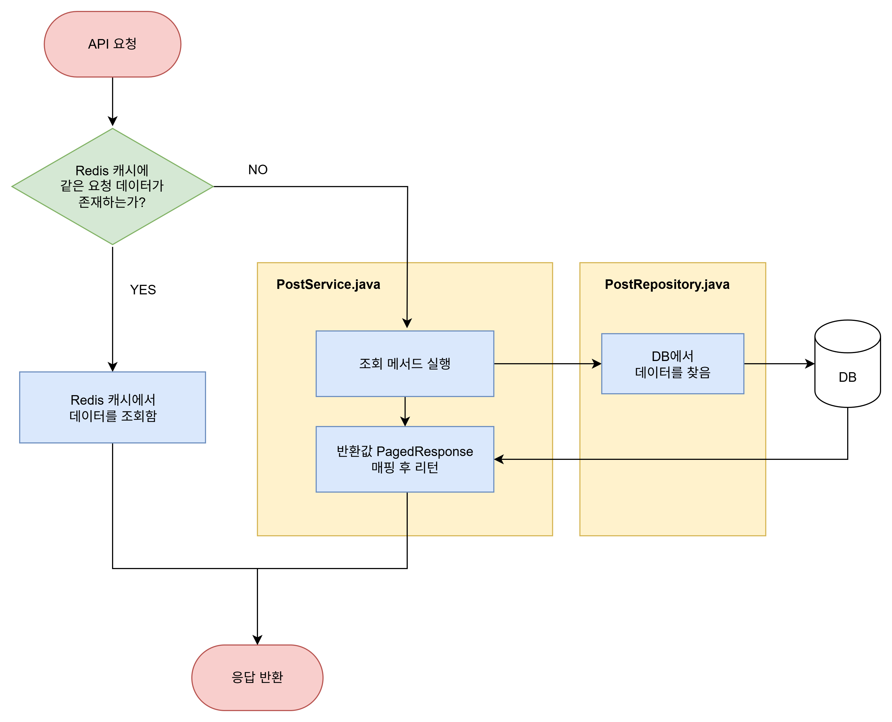

</aside>

---

### 결과 및 효과

실제로 캐시가 조회 성능을 개선했는지 확인하기 위해, nGrinder로 부하 테스트를 진행함

> 1분 동안 50명이 지속적으로 요청을 보내서, 얼마나 요청을 처리할 수 있는지, 하나의 요청을 처리하는 데 몇 초가 걸리는지 확인
>
- 캐시를 적용하게 되면, 전반적으로 **처리량(TPS)이 증가**하고 **평균 테스트 시간(Mean Test Time)이 감소**하는 것을 볼 수 있습니다.
    - TPS는 **약 300% 증가**
    - 최고 TPS는 **약 263% 증가**
    - 평균 테스트 시간은 **약 75% 감소**
    - 실행된 테스트 수는 **약** **318% 증가**

  |                  | **캐싱 적용 안함 V1** | **캐싱 적용함 V2** |
  |------------------|-----------------|---------------|
  | TPS              | 532.4           | 2,129.9       |
  | Peak TPS         | **759**         | **2,755**     |
  | Mean Test Time   | **94.41 ms**    | **23.17 ms**  |
  | Executed Tests   | **27,517**      | **115,523**   |
  | Successful Tests | 27,517          | 115,523       |
  | Errors           | 0               | 0             |

<aside>

**`처리량(TPS)`**

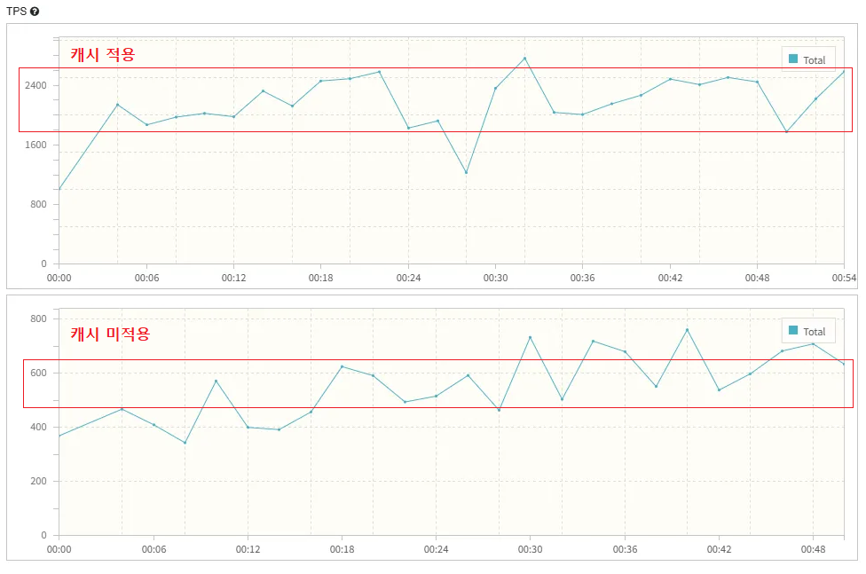

**`평균 테스트 시간(Mean Test Time)`**

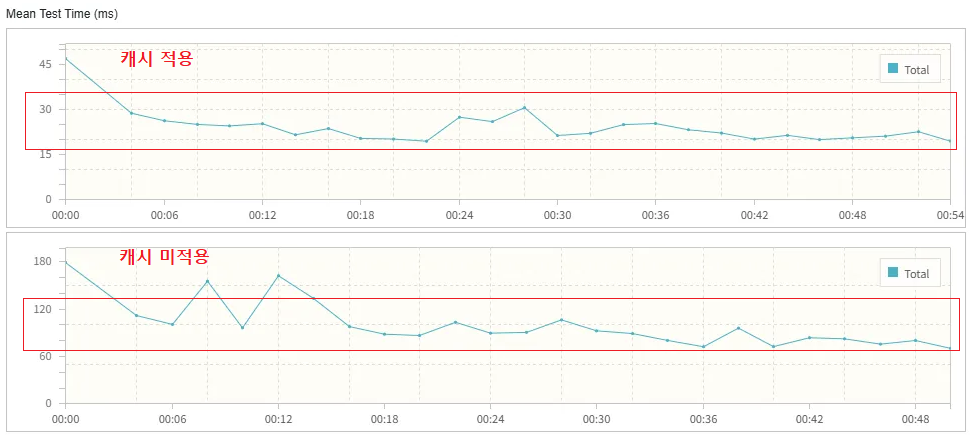

</aside>

---

### 회고
- 캐시 삭제 시, 변경된 데이터가 포함된 캐시만 삭제하는 것이 아닌, 모든 캐시를 삭제함
    - 불필요하게 많은 캐시를 비우게 되는 것 같아, 캐시를 세분화해서 삭제하려 했지만,
      숙련도 및 시간 부족으로 그대로 전체 삭제를 진행함
- 시간적 여유가 있다면 추후 개선할 의향 있음
</details>


<details>
<summary> <strong>🔒 동시에 오는 요청, 어떻게 막죠? - 분산락으로 제어하기 </strong> </summary>

### 문제 정의

1. 서비스의 핵심 기능인 **프로모션/게시글 선착순 신청 및 취소** 로직에서 **동시에 다수의 요청**이 몰릴 수 있음
2. DB 단에서만 처리할 경우,
    - 정원 초과 발생 (**중복 신청 허용**)
    - 동시에 취소 및 수락 시 **데이터 꼬임 발생**
    - Deadlock 혹은 Transaction Rollback으로 **불필요한 비용 발생**
---

### 해결 방법

**Redisson 기반 분산 락 + AOP 적용**

- Redisson은 Redis를 활용하여 **분산 환경에서도 동시성 제어가 가능한 락(Lock) 메커니즘**을 제공
- AOP를 통해 특정 메서드 단위로 **자동 락 관리(획득/해제)** 를 적용 → 코드 간결성 및 유지보수성 향상

|        | **MySQL FOR UPDATE**              | **낙관적 락 (Optimistic Lock)**           | **Redisson 분산락**                           |
|--------|-----------------------------------|---------------------------------------|--------------------------------------------|
| **장점** | - DB에서 바로 지원<br>- 단순하고 빠른 도입      | - 충돌이 적은 환경에서는 효율적 <br>- 별도 인프라 필요 없음 | - 분산 환경에서도 안전 <br> - 재진입, 공정 락 등 다양한 기능 제공 |
| **단점** | - DB 부하 증가 <br> - Deadlock 가능성 존재 | - 충돌이 많으면 성능 저하 <br>- 재시도 로직 필수       | - Redis 의존성 발생 <br>- 운영 복잡성 존재             |

---

### 구현 내용

- 공통 AOP 어노테이션 작성
    - `@DistributedLock(key = "post:#{postId}")` 와 같은 방식으로 선언
    - 메서드 실행 전 Redisson 락을 획득 → 메서드 실행 → 종료 후 락 해제
- Redisson의 `RLock`을 활용해 **분산락** 구현
- 락 적용 메서드 예시
    - 프로모션 / 선착순 게시글 참가 신청
    - 참가 취소
    - 참가 승인/거절

> 실행 흐름
>
> 1. 요청 진입
> 2. AOP Interceptor가 Redisson을 통해 락 획득 시도
> 3. 락 성공 시, 비즈니스 로직 실행
> 4. 로직 종료 후 자동 락 해제
> 5. 락 실패 시, 예외 반환 or 재시도

---

### 결과 및 효과

동시성 제어가 실제로 정합성과 성능에 어떤 영향을 주는지 확인하기 위해 k6로 부하 테스트를 진행함

- **Before (락 없음)**

  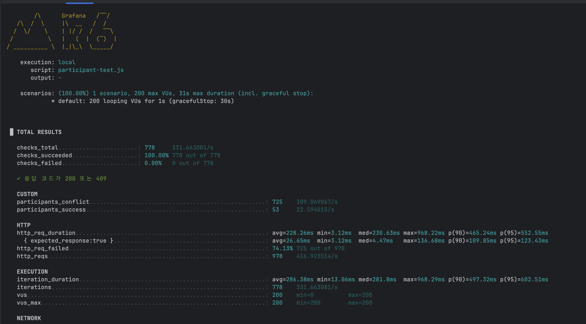

  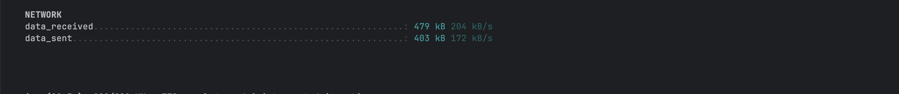

    - 정원 50명 이벤트에 200명 동시 신청 시 → **53명 신청됨 (데이터 불일치 발생)**
- **After (Redisson + AOP 적용)**

  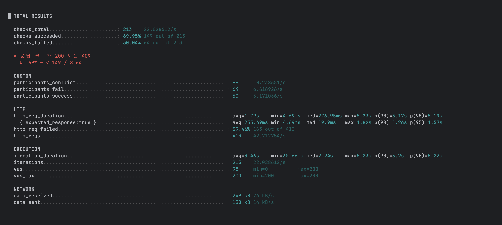

    - 정원 50명 이벤트에 200명 동시 신청 시 → **50명 정확히 신청됨 (데이터 정합성 보장)**
    - TPS 변화는 미미하지만, **Rollback/재시도 비용 감소 → 안정성 개선**

---

### 회고

- 단일 서버 환경에서는 DB 락으로도 충분했겠지만, 추후 **분산 환경을 도입할 가능성이 있기 때문에** Redisson 도입이 필요.
- Redis Cache를 사용할 예정이므로 Redisson을 사용하는 것이 타당해보임
- TPS 자체를 늘리기보다는, **데이터 정합성과 안정성 확보**에 초점을 맞춘 성능 개선으로 이해 가능


</details>


<details>
<summary> <strong>🖥️ 모니터링으로 부하잡기! with 컨슈머 스케일링 </strong> </summary>

### 현재 우리의 상황

- 우리 서비스의 목표 사용자들은 판교(성남)의 개발자들
- 2024-12-29일 기준 총 임직원수 79000명
- <a href="https://m.news.zum.com/articles/95421009/%ED%8C%90%EA%B5%90%ED%85%8C%ED%81%AC%EB%85%B8%EB%B0%B8%EB%A6%AC-%EC%9E%85%EC%A3%BC-%EA%B8%B0%EC%97%85-11-%EC%A6%9D%EA%B0%80-2030-%EC%9E%84%EC%A7%81%EC%9B%90%EC%9D%B4-%EC%A3%BC%EB%A5%98?utm_source=chatgpt.com">판교테크노밸리 입주 기업 11% 증가... 2030 임직원이 주류</a>

### 1. 모수 파악

- **판교 테크노밸리 전체 임직원:** 약 **7.9만 명**
- IT·개발 직군 비중을 보수적으로 **50%** 만 잡아도 → 약 **3.9~4만 명** 개발자
- 스타트업·대기업 근무지 특성상 **20~40대 비율**이 매우 높고, IT 밋업/스터디 문화에 친숙한 인구가 많음 
  
### 2. 서비스 특성과 잠재 수요

- 비슷한 로컬 기반 모임/네트워킹 앱(예: 소모임, Meetup, OKKY 번개) 데이터를 보면:
    - **회원가입 전환율**: 해당 타겟군 중 **10~15%** 정도가 앱에 회원가입
    - **활성 사용자(Active User)**: 가입자의 **30~40%** 정도가 월 1회 이상 접속

    <aside>

    ```yaml
    모수: 40,000명 (판교 개발자)
    회원가입: 10% → 4,000명
    월간 활성 사용자(MAU): 35% → 약 1,400명
    동시접속자(이벤트 피크): MAU의 5~8% → 약 70~110명
    ```

    </aside>

### 3. 정리

- 잘 됐다고 가정한 초기 단계: **MAU 약 1,000~2,000명 (MAU = Mothly Active User)**
- 피크 동시접속: **100명 내외**
- 장기적으로 판교+성남 전역 확장 시 **MAU 수만 명 가능**
- 이 수치는 Kafka·MSA 전환 타이밍을 잡는 기준선으로 활용 가능


### 4. 부하 테스트 및 모니터링

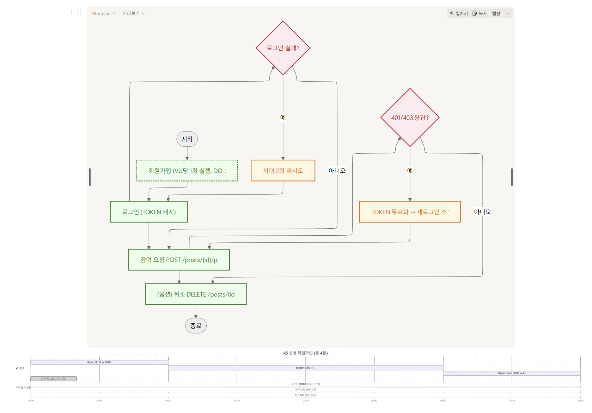

---

### 실험 개요 (Introduction)

- **목적**: Kafka 파티션 및 컨슈머 수 변화에 따른 메시지 처리 성능(처리량, 지연)의 차이를 검증
- **환경**: 동일한 토픽(21개), 메시지 부하 조건은 동일
- **변수**: 파티션(1, 3, 12), 컨슈머 수(1, 3, 12) 외에도 다양한 변수를 주면서 테스트 진행
- 파티션1개, 컨슈머 1개

  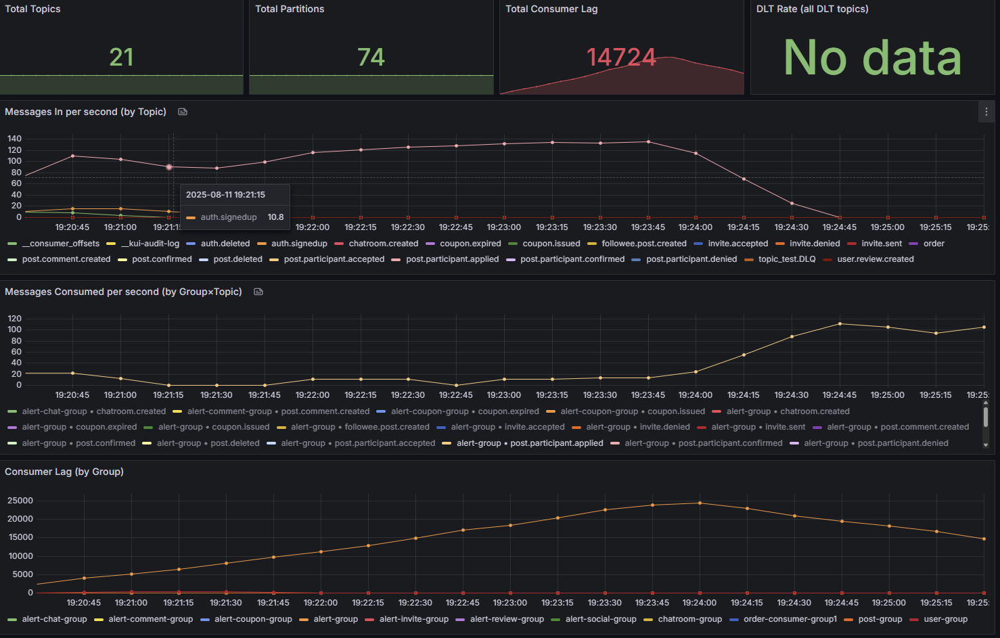

    - 메시지가 들어오지만 처리량이 한계에 도달 → **Lag가 선형적으로 증가**

- 파티션 3개, 컨슈머 3개

  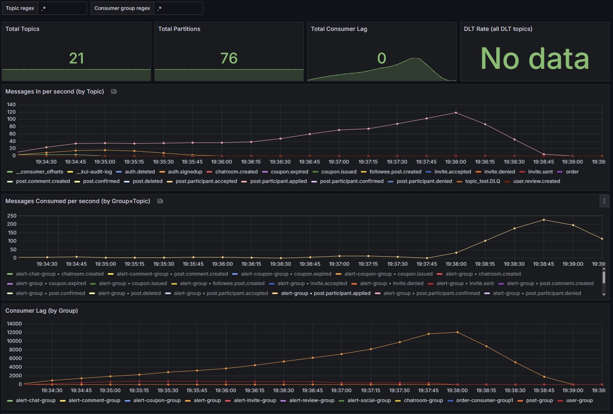

    - 처리량이 증가하며 Lag이 **0 근처로 유지**

- 파티션 12개, 컨슈머 12개

  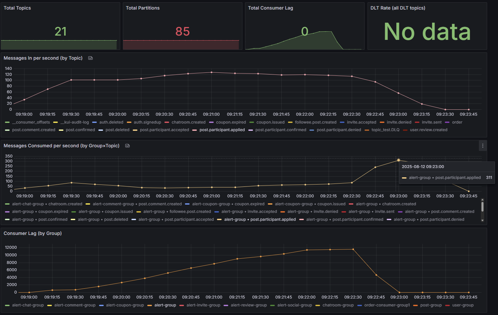
  
    - 소비 속도가 생산 속도와 거의 동일


**→ 최종 파티션/컨슈머 수 결정에 테스트 결과 반영**

</details>


<details>
<summary> <strong>📈 빠르게, 더 빠르게! - Elasticsearch로 초고속 검색하기 </strong> </summary>

### 문제 정의 및 해결 방법

- 현재 게시글 조회 시 다양한 조건 검색과 페이징 처리가 빈번하게 발생함

- 단순 조회나 소규모 데이터셋의 경우 MySQL만으로도 충분히 대응 가능하지만 데이터가 수십만 건 이상 축적되고 검색 조건이 복잡해질수록 MySQL 기반 페이징 성능의 한계가 두드러짐

이에 따라 대규모 데이터 처리와 고성능 검색에 특화된 **Elasticsearch(이하 ES)를 도입**하였으며 실제 성능 차이를 수치적으로 검증하기 위해 벤치마크 테스트를 수행함

---

### 테스트 방법

- **데이터 세팅**
    - 게시글 100,000건 생성 후, MySQL과 ES에 동일하게 적재
    - 랜덤 조건: 성별(Gender), 최대 인원(maxParticipant) 등
- **테스트 환경**
    - MySQL (InnoDB, 기본 인덱스 세팅)
    - Elasticsearch 8.x
    - Spring Boot 환경에서 JUnit 기반 벤치마크 코드 작성
- **측정 방식**
    - `System.currentTimeMillis()` 기반으로 쿼리 수행 시간을 측정
    - 각 구간별 평균값 산출
- **벤치마크 시나리오**
    >    1. 얕은 페이지 조회 (0~50 페이지)
    >    2. 중간 페이지 조회 (100~110 페이지)
    >    3. 깊은 페이지 조회 (500~510 페이지)
    >    4. 조건 랜덤 조회 (20회 반복)

---

### 테스트 코드 (요약)

```java
@Test
@DisplayName("성능 벤치마크 (평균값 출력)")
void benchmark() {
    double[] shallow = runBenchmark("0 ~ 50 페이지", 0, 50, false);
    double[] deep100 = runBenchmark("100 ~ 110 페이지", 100, 110, false);
    double[] deep500 = runBenchmark("500 ~ 510 페이지", 500, 510, false);
    double[] random = runBenchmark("조건 랜덤", 10, 20, true);

    System.out.println("\n===== 성능 결과 요약 (평균 ms) =====");
    System.out.printf("0 ~ 50 페이지: MySQL=%.2f ms, ES=%.2f ms%n", shallow[0], shallow[1]);
    System.out.printf("100 ~ 110 페이지: MySQL=%.2f ms, ES=%.2f ms%n", deep100[0], deep100[1]);
    System.out.printf("500 ~ 510 페이지: MySQL=%.2f ms, ES=%.2f ms%n", deep500[0], deep500[1]);
    System.out.printf("조건 랜덤(20회): MySQL=%.2f ms, ES=%.2f ms%n", random[0], random[1]);
}
```

---

### 벤치마크 결과 요약 (MySQL vs Elasticsearch 평균 응답 시간)

| 구간            | MySQL (평균) | Elasticsearch (평균) |
|---------------|------------|--------------------|
| 0 ~ 50 페이지    | 30.29 ms   | 12.25 ms           |
| 100 ~ 110 페이지 | 16.36 ms   | 5.82 ms            |
| 500 ~ 510 페이지 | 15.45 ms   | 6.73 ms            |
| 조건 랜덤(20회)    | 44.27 ms   | 6.82 ms            |


---

### 테스트 분석 및 결론

- **얕은 페이지(0~50)**: MySQL도 크게 뒤지지 않지만, ES가 평균적으로 2~3배 빠르다.
- **깊은 페이지(500+)**: MySQL 성능이 눈에 띄게 떨어지지는 않았지만 ES가 훨씬 안정적이다.
    - MySQL은 OFFSET 기반 페이징이라 페이지가 깊어질수록 `LIMIT` 전에 불필요한 데이터를 스캔한다.
    - ES는 검색엔진 특화 구조라 페이징 시에도 빠른 응답속도를 보인다.
- **랜덤 조건 조회**: MySQL은 조인/조건 조합이 많아질수록 느려지지만, ES는 거의 일정한 속도를 유지한다.
- **종합**: 단순 조회만 하면 MySQL도 충분하지만, 다양한 조건 검색 + 깊은 페이징 환경에서는 ES의 장점이 크게 드러난다.

</details>

---
<h2 id="tech-stack"> 🛠️ 기술 스택 </h2>


---


## 👨‍👩‍👧‍👦 **팀 구성원 소개**
| **구성원**  | **직책**  | **장점**                                       | **GitHub**                                | **Blog**                                        | **담당**                                                                                                     |
|----------|---------|----------------------------------------------|-------------------------------------------|-------------------------------------------------|------------------------------------------------------------------------------------------------------------|
| **김민균**  | `👑팀장`  | `🎨아이디어 뱅크`<br> `❄️냉철한 시선`<br> `😄즐거움의 달인`   | [GitHub](https://github.com/MinGyunKim27) | [블로그](https://velog.io/notifications)           | 📌 Kafka 시각화(모니터링)<br>📌 배포(CI/CD) <br> 📌 기술스택, 취미 기능 구현 <br>📌 유저 팔로우 구현                                 |
| **김지현**  | `👑부팀장` | `🔠오탈자 귀신`<br> `🎧인간GPT`<br> `💯MBTI J 100%` | [GitHub](https://github.com/jh-01)        | [블로그](https://everyday-for-coding.tistory.com/) | 📌 동시성 제어<br>📌 Logging<br>📌 엘라스틱 bulk 처리<br> 📌 프로필 조회, 수정 상대방 리뷰 조회 기능 구현 <br>📌 성능지표 시각화               |
| **류수연**  | `🎖️팀원` | `🐞버그헌터`<br> `☯️워라밸 마스터`<br> `👦바른어린이`       | [GitHub](https://github.com/ryusu12)      | [블로그](https://velog.io/@rsy7567/posts)          | 📌 Logging<br>📌 Redis Cache<br>📌 쿼리 최적화<br> 📌 게시글 신청 CRUD 기능 구현 <br>📌 성능지표 시각화                         |
| **박  진** | `🏅팀원`  | `👂경청의 대가`<br> `🏆노력 끝판왕`<br> `✍️글의 조각가`     | [GitHub](https://github.com/ParkJin0814)  | [블로그](https://velog.io/@klkl97/posts)           | 📌 Kafka 재시도 설계<br>📌 OAuth 로그인 구현<br>📌 Refresh Token을 이용한 토큰 재발급<br>📌 사용자 리뷰 시스템 구현 <br>📌 쿠폰 CRUD기능 구현 |
| **이안근**  | `🥇팀원`  | `❄️아이스 브레이커`<br> `🔥레벨업 장인`<br> `📅1일1독`     | [GitHub](https://github.com/roog23)       | [블로그](https://roog23.tistory.com/)              | 📌 Kafka 재시도 설계<br>📌 Elasticsearch<br> 📌 회원가입, 로그인 기능 구현 <br>📌 실시간 채팅방 기능 구현                            |
| **최영재**  | `🥇팀원`  | `❄️아이스 브레이커`<br> `🔥레벨업 장인`<br> `📅1일1독`     | [GitHub](https://github.com/teopteop)     | [블로그](https://velog.io/@teopteop/posts)         | 📌 Kafka 재시도 설계<br>📌 Elasticsearch<br>📌 문서 정리 <br>📌 게시글CRUD기능 구현                                        |
